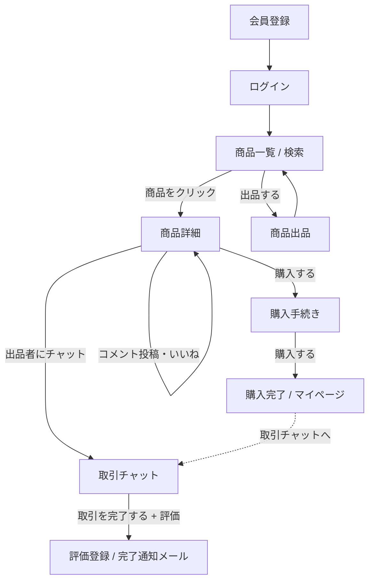
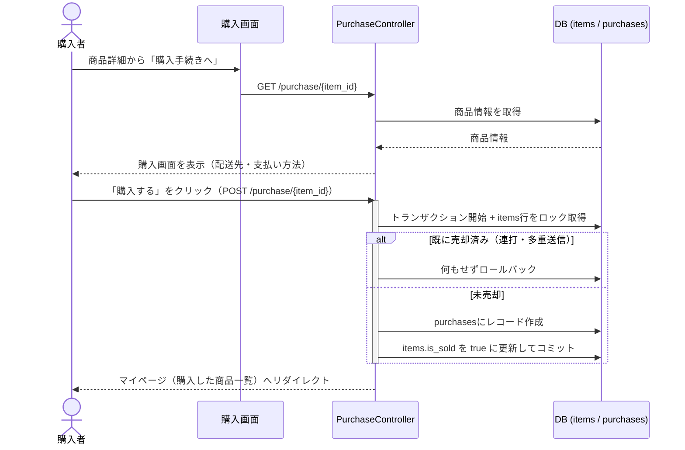
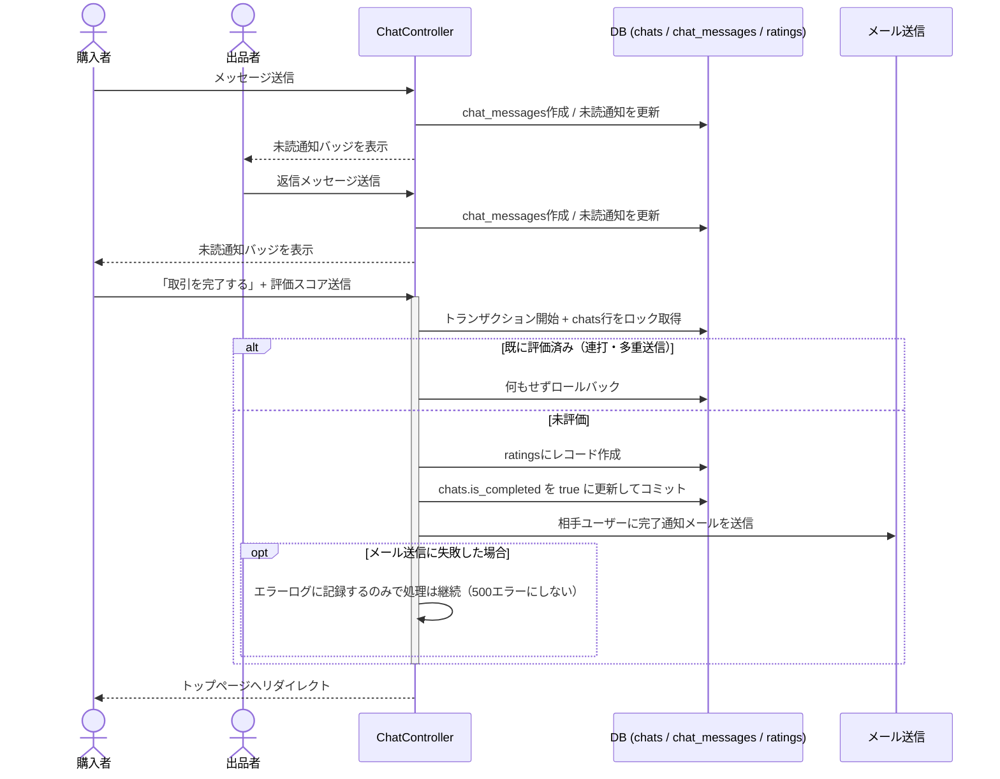
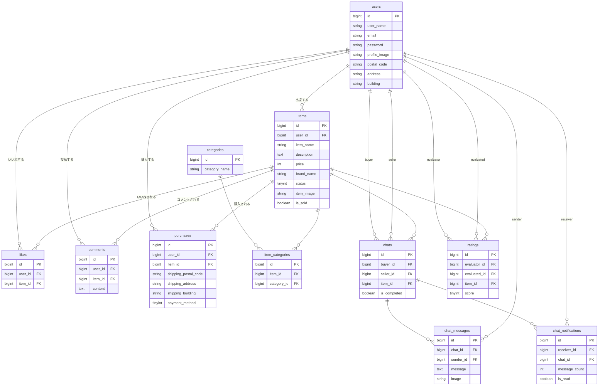

# フリマアプリ

Laravel製のフリマアプリです。プログラミングスクールの卒業課題として、要件定義から設計・実装、
Docker環境構築、本番環境へのデプロイまで一通り制作しました。

## ライブデモ

- URL：https://flea-market-hfk0.onrender.com
- ログインせずに商品一覧・検索・商品詳細は閲覧できます。
- 出品・購入・チャット等の機能を試す場合は、下記「ダミーデータ」のアカウントでログインしてください。

## スクリーンショット

（準備中。画面キャプチャやGIFを追加予定です）

| 商品一覧 | 商品詳細 | 取引チャット |
| --- | --- | --- |
| (準備中) | (準備中) | (準備中) |

## 主な機能

- 会員登録・ログイン（Laravel Fortify）
- 商品一覧表示・キーワード検索
- 商品詳細表示・コメント投稿・いいね（お気に入り）
- 商品出品（画像アップロード）
- 商品購入（配送先住所の一時変更、購入完了までの導線）
- マイページ（プロフィール編集・アイコン画像アップロード、出品/購入/いいね商品一覧）
- 取引チャット（メッセージの送信・編集・削除、取引完了操作、未読通知）
- 取引完了後の相手ユーザーへの評価（5段階評価）

## 画面遷移・処理フロー

商品閲覧から出品・購入・取引チャット・評価まで、画面がどうつながっているかの全体像です。



特に処理が複雑な「商品購入」と「取引チャット〜評価完了」は、二重送信防止のための
行ロック（`lockForUpdate`）を挟んでいるため、シーケンス図で流れを示します。

### 商品購入の流れ



### 取引チャット〜評価完了の流れ



## 工夫した点

- 出品→購入→取引チャット→評価まで、実際のフリマサービスに近い一連の取引の流れを一通り実装しました。
- 購入・評価は連打や通信の遅延・リトライで多重登録されないよう、`DB::transaction` + `lockForUpdate`
  による行ロックで二重送信を防止しています（上記シーケンス図の分岐部分）。仕様書には無い対応です。
- バリデーションはコントローラに直書きせず、`FormRequest`（`ItemRequest`、`PurchaseRequest`、`CommentRequest`など）に分離し、見通しを良くしています。
- 取引チャットはメッセージの編集・削除や取引完了操作、未読通知まで含めて実装し、単なる一覧・詳細のCRUDで終わらないようにしました。
- 案件シートのテストケース一覧・機能要件をもとにしたFeatureテスト（71件）を整備し、GitHub Actionsで
  push・PR時に自動実行するようにしています。
- ローカル開発はDocker（nginx + PHP-FPM + MySQL）で環境差異なく再現できるようにし、本番はRender + Neon(PostgreSQL)で無料の範囲で公開できる構成にしています。
- 本番用の接続情報やAPP_KEYはコードに含めず、すべて環境変数経由で読み込む形にしています。

## 使用技術

| 分類 | 技術 |
| --- | --- |
| 言語 | PHP 8.2 |
| フレームワーク | Laravel 9.52.18 |
| 認証 | Laravel Fortify |
| ローカルDB | MySQL 8.0.26（Docker） |
| 本番DB | PostgreSQL（[Neon](https://neon.tech)） |
| Webサーバー | nginx（ローカル） / Apache（本番Dockerイメージ） |
| インフラ（ローカル） | Docker / docker-compose |
| インフラ（本番） | [Render](https://render.com)（Dockerデプロイ） |
| その他 | MailHog（開発時のメール確認） |

## ER図



## 環境構築（ローカル・Docker）

### Dockerビルド
1. git clone リンク
2. docker-compose up -d --build

＊ MySQLは、OSによって起動しない場合があるのでそれぞれのPCに合わせてdocker-compose.ymlファイルを編集してください。

### Laravel環境構築
1. docker-compose exec php bash
2. composer install
3. .env.exampleファイルから.envを作成し、環境変数を構築（MAILは以下のように修正）
````
MAIL_HOST=mail
MAIL_FROM_ADDRESS=info@example.com
````
4. php artisan key:generate
5. php artisan migrate
6. php artisan db:seed
7. php artisan storage:link

### ローカルURL
- 開発環境：http://localhost/
- phpMyAdmin：http://localhost:8080/
- MailHog：http://localhost:8025/

## ダミーデータ
### C001～C005の商品データを出品したユーザ
- メールアドレス；mercari@coachtech.com
- パスワード：password
### C006～C010の商品データを出品したユーザ
- メールアドレス；amazon@coachtech.com
- パスワード：password
### 何も紐づけられていないユーザ
- メールアドレス；rakuten@coachtech.com
- パスワード：password

## 本番デプロイ（Render + Neon）

ローカルはMySQLですが、本番はRender（Dockerデプロイ）+ Neon（PostgreSQL）で無料の範囲で構築しています。

- ビルドにはリポジトリ直下の `Dockerfile` を使用します（ローカルの `docker/php/Dockerfile` とは別物で、Apache + PHPの単一コンテナ構成です）。
- コンテナ起動時（`docker/render/entrypoint.sh`）に設定キャッシュの生成、`migrate --force`、`storage:link` を自動実行します。
- 必要な環境変数の一覧は [`src/.env.production.example`](src/.env.production.example) にまとめています（値は空のテンプレートです）。実際の値はRenderの環境変数設定画面から入力してください。
- `.env` ファイルや接続パスワード、APP_KEYはリポジトリにコミットしていません。すべて環境変数経由で渡す想定です。
- NeonはSSL接続が必須のため、PostgreSQL接続には `sslmode=require` をデフォルトで付与しています（`DB_SSLMODE` で上書き可能）。

### 既知の制約
- Renderの無料プランは一定時間アクセスが無いとスリープするため、しばらく使われていない状態からの初回アクセスは表示までに数十秒かかることがあります。
- Renderの無料プランはファイルシステムが永続化されないため、アップロードした商品画像・アイコン画像はデプロイや再起動のタイミングで消える可能性があります。
- 本番のメール送信は未設定です（`MAIL_MAILER=log`）。会員登録時のメール認証を有効化する場合は別途SMTP等の設定が必要です。
